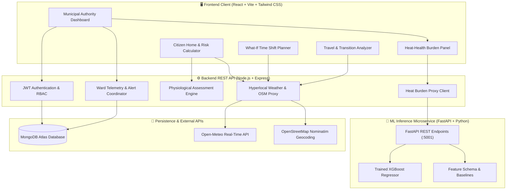

# 🌡️ Taap Chetna — Hyperlocal Heat-Health Intelligence Platform

<p align="center">
  
  
  
  
  
  
</p>

---

## 📑 Overview
**Taap Chetna** is a comprehensive, real-time localized heat-health platform providing physiological risk profiling, hyperlocal weather telemetry, municipal ward-level heat vulnerability monitoring, and time-aware activity planning.

### 🌟 Key Pillars
- 📍 **Hyperlocal Geocoding & Weather Telemetry**: Direct integration with OpenStreetMap (Nominatim) and Open-Meteo for live real-time heat indices across cities and villages.
- 🩺 **Personal Physiological Risk Calculator**: Evaluates age, pre-existing conditions, outdoor exposure duration, and hydration to calculate personalized vulnerability scores.
- ⏳ **"What-If" Time-Aware Activity Planner**: Simulates physiological strain across time slots to recommend safer alternatives for outdoor work and transit.
- 🚦 **Travel & Transition Risk Analyzer**: Compares origin and destination microclimates with advisory warnings for intra-city and inter-city commutes.
- 🏛️ **Municipal & Ward-Level Administrative Dashboard**: Role-based access control (RBAC) enabling municipal authorities to monitor ward vulnerabilities, trigger emergency cooling alerts, and coordinate response protocols.
- 🤖 **Macro Heat-Health Burden ML Intelligence**: State-year supervised XGBoost & Decision Tree regression microservice predicting population-scale heat-health burden, feature importances, and municipal operational advisories.

---

## 🏗️ System Architecture



---

## 📁 Repository Structure

```text
taap-chetna/
├── frontend/             # React 19 + Vite frontend client application
│   ├── src/
│   │   ├── components/   # Modular UI components (Risk, What-If, Ward Dashboard, ML Panel)
│   │   ├── context/      # Auth & Theme context providers
│   │   ├── data/         # Indian places & reference data
│   │   └── services/     # Axios client API service integrations
│   └── package.json
├── backend/              # Express REST API backend server
│   ├── config/           # Database configuration & seeding scripts
│   ├── controllers/      # Route controllers (Auth, Weather, Wards, What-If, Authority)
│   ├── middleware/       # JWT Authentication & role verification
│   ├── models/           # Mongoose schemas (User, Ward, Alert, TravelPlan)
│   ├── routes/           # Express API route declarations
│   ├── services/         # Open-Meteo, Nominatim, and ML microservice integration
│   └── package.json
├── ml/                   # Python Machine Learning Subsystem
│   ├── models/           # Pre-trained models (XGBoost, Decision Tree), schemas & metrics
│   ├── scripts/          # Aggregation, NASA POWER downloader, ETL tools
│   ├── utils/            # Rothfusz Heat Index, GeoJSON boundary matching, Census populations
│   ├── train_pipeline.py # End-to-end model training & evaluation pipeline
│   └── serve.py          # High-performance FastAPI inference microservice (port 5001)
├── ML_REPORT.md          # Comprehensive ML model benchmark, evaluation & feature analysis
├── .gitignore
├── start-all.bat         # Single-click Windows startup script (Node + Vite + FastAPI)
└── package.json          # Root concurrency orchestration script
```

---

## ⚡ Quick Start

### 1. Prerequisites
- **Node.js**: v18.0.0 or higher
- **Python**: 3.10+ (with `pip install fastapi uvicorn xgboost scikit-learn pandas numpy joblib requests`)
- **MongoDB**: Local MongoDB instance or MongoDB Atlas URI

### 2. Environment Configuration
Create a `.env` file in the `backend/` directory:
```env
PORT=5000
MONGO_URI=mongodb://localhost:27017/taap-chetna
JWT_SECRET=your_super_secret_jwt_key
JWT_EXPIRES_IN=7d
ML_SERVICE_URL=http://127.0.0.1:5001
```

### 3. Installation & Local Execution
From the root directory:
```bash
# Install all dependencies across root, backend, and frontend
npm run install-all

# Start backend, frontend, and ML inference service concurrently
npm run dev
```

The application will be accessible at:
- **Frontend**: [http://localhost:5173](http://localhost:5173)
- **Backend API**: [http://localhost:5000](http://localhost:5000)
- **ML Engine API**: [http://localhost:5001](http://localhost:5001) (Docs at `/docs`)

---

## 📜 License
This project is licensed under the MIT License - see the [LICENSE](LICENSE) file for details.
