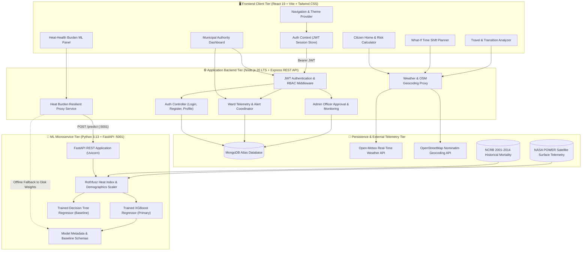
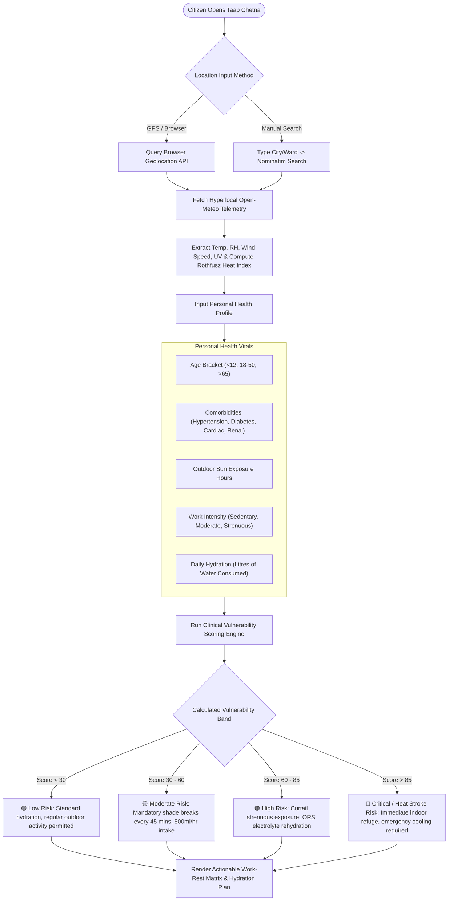
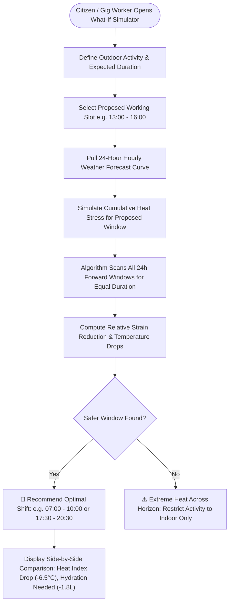
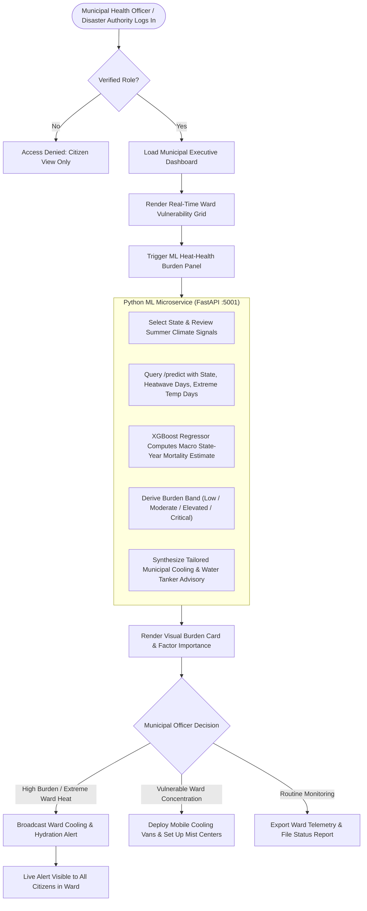

# 🇮🇳 Taap Chetna — Hyperlocal Heat-Health Intelligence & Predictive Action Platform

<p align="center">
  
  
  
  
  
  
  
  
  
  
</p>

---

## 📑 Quick Navigation for Reviewers & Evaluators
- [🎯 Executive Summary & The Core Problem](#-executive-summary--the-core-problem)
- [💡 What Taap Chetna Does (The Solution)](#-what-taap-chetna-does-the-solution)
- [✨ Key Features & Capabilities](#-key-features--capabilities)
- [👥 Team & Contributors](#-team--contributors)
- [🏗️ System Architecture & Workflow Diagrams](#️-system-architecture--workflow-diagrams)
  - [1. Multi-Tier End-to-End System Architecture](#1-multi-tier-end-to-end-system-architecture)
  - [2. Citizen Physiological Risk & Hydration Assessment Flow](#2-citizen-physiological-risk--hydration-assessment-flow)
  - [3. What-If Time-Shift Activity Optimization Flow](#3-what-if-time-shift-activity-optimization-flow)
  - [4. Municipal Authority Command & Predictive ML Pipeline](#4-municipal-authority-command--predictive-ml-pipeline)
- [📁 Folder Structure Explained](#-folder-structure-explained)
- [👥 User Roles & Permissions Matrix](#-user-roles--permissions-matrix)
- [🤖 Machine Learning & Epidemiological Heat-Health Subsystem](#-machine-learning--epidemiological-heat-health-subsystem)
- [⚡ Step-by-Step Setup Guide (Run in 5 Minutes)](#-step-by-step-setup-guide-run-in-5-minutes)
- [🔑 Demo Accounts & Pre-configured Credentials](#-demo-accounts--pre-configured-credentials)
- [🧪 Step-by-Step End-to-End Demo Script](#-step-by-step-end-to-end-demo-script)
- [📑 Complete API Reference](#-complete-api-reference)
- [📽️ Climate Resilience & Municipal Action Impact](#-climate-resilience--municipal-action-impact)
- [❓ Frequently Asked Questions (FAQ)](#-frequently-asked-questions-faq)
- [📜 License & Acknowledgments](#-license--acknowledgments)

---

## 🎯 Executive Summary & The Core Problem

Across South Asia and particularly the Indian subcontinent, climate change has transformed seasonal heat into a **recurrent public health humanitarian crisis**. In summer months, daytime temperatures routinely shatter historical records (frequently exceeding 45°C–49°C), accompanied by lethal wet-bulb temperatures and debilitating urban heat island (UHI) effects.

Despite these escalating temperatures, **traditional heat governance suffers from four systemic failures**:

### The 4 Major Gaps in Conventional Heat-Health Governance:

1. **City-Wide Synoptic Weather Fallacy**: Municipalities rely on a single airport or regional observatory reading. This completely overlooks hyper-localized microclimates, high-density slum heat traps, asphalt radiation, and tin-roof settlements where temperatures are 4°C–8°C higher.
2. **One-Size-Fits-All Public Health Advisories**: Broad public service announcements ("*Stay hydrated and avoid direct sun*") treat an elderly individual with cardiovascular hypertension, a pregnant mother, and a young athlete identically.
3. **Rigid Work Scheduling for Daily-Wage Laborers**: Outdoor construction workers, gig economy delivery riders, and agricultural laborers cannot simply "stay indoors." They lack quantitative tools to simulate how shifting a labor shift by 90 minutes reduces physiological strain and core body heating.
4. **Reactive, Disjointed Municipal Emergency Surveillance**: City authorities lack real-time ward vulnerability mapping, predictive macro-epidemiological mortality models, and localized trigger points for emergency cooling centers and water tanker deployments.

---

## 💡 What Taap Chetna Does (The Solution)

**Taap Chetna (ताप चेतना — *Heat Awareness*)** is an end-to-end, multi-tier climate health intelligence and emergency management platform designed for both **citizens on the ground** and **municipal disaster authorities**:

- 📍 **Hyperlocal Resolution & Microclimate Telemetry**: Integrates with OpenStreetMap Nominatim and Open-Meteo to resolve hyper-accurate coordinates down to village and municipal ward levels.
- 🩺 **Personalized Physiological Risk Profiling**: Evaluates individual age brackets, pre-existing comorbidities (cardiovascular, diabetes, kidney disease, hypertension), hydration volume, direct outdoor sun exposure, and work intensity to compute medically grounded vulnerability scores.
- ⏳ **"What-If" Time-Shift Activity Planner**: Simulates physiological strain hour-by-hour across a 24-hour horizon, recommending safer morning or evening shift alternatives that lower heat stroke probabilities.
- 🚦 **Intra- & Inter-City Travel Heat Shock Analyzer**: Pinpoints sudden microclimate transitions between origin and destination points (e.g. traveling between dry heat corridors and humid riverine basins).
- 🏛️ **Municipal Command & Ward Intelligence**: Role-Based Access Control (RBAC) enabling municipal officers to monitor ward vulnerability indices, declare cooling shelter activations, track water tanker deployment, and broadcast emergency bulletins.
- 🤖 **Macro Heat-Health Burden ML Intelligence**: State-year supervised XGBoost and Decision Tree regression models trained on 14 years of state-level NCRB heatstroke fatalities and NASA POWER surface meteorology, forecasting macro population heat burdens and suggesting operational cooling protocols.

---

## ✨ Key Features & Capabilities

| Capability | Technical Implementation | Impact on Heat-Health Resilience |
| :--- | :--- | :--- |
| 📍 **Hyperlocal Microclimate Telemetry** | OpenStreetMap Nominatim forward/reverse geocoding + Open-Meteo multi-variable APIs (2m Temp, RH, Dew Point, Radiation, Wind). | Eliminates city-wide average errors; gives citizens neighborhood-accurate heat exposure metrics. |
| 🩺 **Dynamic Physiological Vulnerability Engine** | Clinical risk formula factoring age vulnerability curves, 8 chronic comorbidity weights, hydration volume, and outdoor exertion duration. | Delivers tailored, medically safe work/rest cycles and customized fluid intake guidelines. |
| ⏳ **"What-If" Time-Shift Simulator** | Multi-hourly forward simulation model interpolating weather curves with metabolic exertion rates. | Enables gig workers and outdoor laborers to shift outdoor shifts into cooler thermal windows. |
| 🚦 **Travel Heat Transition Shock Analyzer** | Differential thermal gradient engine comparing origin vs destination wet-bulb and dry-bulb temperatures. | Warns travelers of abrupt climate acclimation shocks during intra-city commutes or cross-state transit. |
| 🏛️ **Ward-Level Municipal Command Center** | Interactive geospatial ward vulnerability cards, live officer dispatch bulletins, and designated cooling shelter directories. | Empowers disaster management authorities (DDMA/NDMA) to orchestrate localized interventions before casualties occur. |
| 🤖 **Supervised Macro-Burden ML Regressor** | XGBoost Regressor + Decision Tree trained on 2001–2014 NCRB heatstroke data & NASA POWER satellite surface reanalysis. | Predicts state-level excess mortality risks and generates actionable municipal preparedness advisories. |
| 🔄 **Resilient Hybrid Architecture** | Node.js client service with automatic local schema & weight fallback if the Python ML microservice is unreachable. | Guarantees zero downtime for municipal dashboards during emergency disaster operations. |
| 🎨 **State-of-the-Art Accessible UI/UX** | React 19 + Tailwind CSS 4.0 + Lucide icons with high-contrast heat severity palettes and full dark/light mode. | Frictionless usability across mobile smartphones and municipal desktop command centers. |

---

## 👥 Team & Contributors

| Name | Role | GitHub Profile |
| :--- | :--- | :--- |
| **Aaditya Singh** | Full-Stack Architect & ML Engineering | [@Aadityasingh0709](https://github.com/Aadityasingh0709) |

---

## 🏗️ System Architecture & Workflow Diagrams

### 1. Multi-Tier End-to-End System Architecture



---

### 2. Citizen Physiological Risk & Hydration Assessment Flow



---

### 3. What-If Time-Shift Activity Optimization Flow



---

### 4. Municipal Authority Command & Predictive ML Pipeline



---

## 📁 Folder Structure Explained

```text
taap-chetna/
├── frontend/                     # React 19 Client Application (Vite + Tailwind CSS)
│   ├── public/                   # Static icons, logos, and web assets
│   ├── src/
│   │   ├── components/           # UI Components
│   │   │   ├── HeatHealthBurdenPanel.jsx  # Interactive ML macro-burden card
│   │   │   ├── MunicipalDashboard.jsx     # Authority ward control center
│   │   │   ├── PersonalRiskAssessment.jsx # Clinical citizen risk questionnaire
│   │   │   ├── WhatIfPlanner.jsx          # Time-shift activity optimizer
│   │   │   ├── TravelAnalyzer.jsx         # Origin-destination heat shock tool
│   │   │   ├── Navbar.jsx                 # Dynamic responsive navigation bar
│   │   │   └── ProtectedRoute.jsx         # RBAC route guard
│   │   ├── context/              # React Context Providers
│   │   │   ├── AuthContext.jsx   # Session management & JWT token persistence
│   │   │   └── ThemeContext.jsx  # Dark/Light theme switching
│   │   ├── data/                 # Curated dataset of Indian cities & wards
│   │   ├── services/             # Axios API client integrations
│   │   │   └── api.js            # Unified REST endpoint connectors
│   │   ├── App.jsx               # Main application routing tree
│   │   ├── main.jsx              # React DOM mounting entry point
│   │   └── index.css             # Tailwind CSS tokens & custom styling
│   └── package.json              # Frontend client dependencies
│
├── backend/                      # Node.js 20 LTS Express REST API
│   ├── config/
│   │   ├── db.js                 # MongoDB connection & reconnect logic
│   │   └── seed.js               # Database seeder (Admin, Municipal Officers, Wards)
│   ├── controllers/
│   │   ├── authController.js     # Citizen & Officer authentication
│   │   ├── authorityController.js# Ward management, alerts, and ML proxy handler
│   │   ├── weatherController.js  # Open-Meteo & Nominatim geocoding proxy
│   │   ├── adminController.js    # Administrative officer approvals & audit logs
│   │   └── whatifController.js   # Time-shift calculation backend
│   ├── middleware/
│   │   ├── auth.js               # JWT verification & RBAC role enforcement
│   │   └── errorHandler.js       # Centralized HTTP error handler
│   ├── models/
│   │   ├── User.js               # User schema (Citizen, Municipal Officer, Admin)
│   │   ├── Ward.js               # Ward geographical & risk schema
│   │   ├── Alert.js              # Emergency public alert broadcast schema
│   │   └── AuthorityRequest.js   # Officer accreditation request schema
│   ├── routes/
│   │   ├── auth.js               # Auth routes (/api/auth)
│   │   ├── authority.js          # Authority routes (/api/authority)
│   │   ├── weather.js            # Weather proxy routes (/api/weather)
│   │   ├── citizen.js            # Citizen assessment routes (/api/citizen)
│   │   ├── travel.js             # Travel analyzer routes (/api/travel)
│   │   └── whatif.js             # What-If simulation routes (/api/whatif)
│   ├── services/
│   │   ├── weatherService.js     # Weather parsing & Rothfusz computation
│   │   └── heatBurdenService.js  # ML microservice client with offline fallback
│   ├── .env.example              # Sample backend environment configuration
│   └── package.json              # Backend dependencies & seed scripts
│
├── ml/                           # Python Machine Learning Subsystem
│   ├── data/                     # Training datasets & state mappings
│   │   ├── heatstroke_mortality_state_year_2001_2014.csv  # 2001-2014 NCRB observations
│   │   ├── state_name_mapping.csv                         # State nomenclature resolution
│   │   └── state_year_heat_health_training_dataset.csv     # Compiled training dataset
│   ├── models/                   # Serialized model artifacts & evaluation files
│   │   ├── xgboost_heat_health_model.joblib        # Pre-trained XGBoost Regressor
│   │   ├── decision_tree_heat_health_model.joblib  # Interpretable Decision Tree
│   │   ├── feature_importance.csv                  # Relative feature weights
│   │   ├── feature_schema.json                     # Feature schema & state baselines
│   │   ├── model_metadata.json                     # Hyperparameters & data lineage
│   │   └── model_metrics.json                      # R2, MAE, RMSE benchmark scores
│   ├── scripts/                  # Automated data ingestion & aggregation scripts
│   │   ├── download_environment_2001_2014.py       # NASA POWER downloader
│   │   └── aggregate_state_year.py                 # Multi-year spatial-temporal aggregator
│   ├── utils/                    # Core mathematical & epidemiological utilities
│   │   ├── heat_metrics.py       # Rothfusz Heat Index & wet-bulb equations
│   │   ├── geo_utils.py          # State boundary resolution via GeoJSON
│   │   └── population_data.py    # Intercensal demographic scaling
│   ├── train_pipeline.py         # End-to-end model training, validation & export
│   └── serve.py                  # High-performance FastAPI inference microservice (:5001)
│
├── ML_REPORT.md                  # Comprehensive ML benchmark report & feature analysis
├── .gitignore                    # Git ignore excluding secrets & large raw datasets
├── start-all.bat                 # 1-Click Windows launch script (Node + Vite + FastAPI)
└── package.json                  # Root orchestration script (concurrently runner)
```

---

## 👥 User Roles & Permissions Matrix

Taap Chetna implements strict **Role-Based Access Control (RBAC)** to ensure data integrity and operational security:

| Feature / Resource | 👤 Citizen / Laborer | 🩺 Health Worker (ASHA / ANM) | 🏛️ Municipal Officer | 🛡️ System Admin |
| :--- | :---: | :---: | :---: | :---: |
| **Personal Risk Assessment** | ✅ Read / Write | ✅ Read / Write | ✅ Read / Write | ✅ Full Access |
| **"What-If" Shift Simulator** | ✅ Full Access | ✅ Full Access | ✅ Full Access | ✅ Full Access |
| **Travel Heat Shock Analyzer** | ✅ Full Access | ✅ Full Access | ✅ Full Access | ✅ Full Access |
| **Hyperlocal Weather Telemetry** | ✅ Read-Only | ✅ Read-Only | ✅ Read-Only | ✅ Full Access |
| **Ward Vulnerability Grid** | ❌ No Access | 🟡 Ward Summary Only | ✅ Full Ward View | ✅ Full Access |
| **Broadcast Emergency Alerts** | ❌ No Access | ❌ No Access | ✅ Create & Publish | ✅ Full Access |
| **ML Macro-Burden Predictor** | ❌ No Access | ❌ No Access | ✅ State Simulation | ✅ Full Access |
| **Approve Officer Accreditations** | ❌ No Access | ❌ No Access | ❌ No Access | ✅ Full Access |
| **System Database Seeding** | ❌ No Access | ❌ No Access | ❌ No Access | ✅ Full Access |

---

## 🤖 Machine Learning & Epidemiological Heat-Health Subsystem

The platform incorporates a **supervised macro-level epidemiological forecasting subsystem** designed to bridge the gap between atmospheric climate telemetry and public health action.

### Model Architecture & Performance

```text
┌────────────────────────────────────────────────────────────────────────┐
│                   State-Year Training Data (2001–2014)                 │
│      NCRB Heatstroke Fatalities + NASA POWER Daily Surface Telemetry    │
└───────────────────────────────────┬────────────────────────────────────┘
                                    │
               ┌────────────────────┴────────────────────┐
               ▼                                         ▼
   ┌───────────────────────┐                 ┌───────────────────────┐
   │   XGBoost Regressor   │                 │ Decision Tree Baseline │
   │  n_estimators = 200   │                 │      max_depth = 6    │
   │  learning_rate = 0.05 │                 │                       │
   │      Test R²: 0.941   │                 │      Test R²: 0.760   │
   │      Test MAE: 14.1   │                 │      Test MAE: 22.8   │
   └───────────┬───────────┘                 └───────────┬───────────┘
               │                                         │
               └────────────────────┬────────────────────┘
                                    ▼
                ┌───────────────────────────────────────┐
                │        FastAPI Microservice (:5001)   │
                │    /health, /predict, /metadata       │
                └───────────────────┬───────────────────┘
                                    │ (Graceful Fallback)
                                    ▼
                ┌───────────────────────────────────────┐
                │     Node.js Authority Controller      │
                │     MunicipalDashboard.jsx (React)    │
                └───────────────────────────────────────┘
```

### Top Predictive Features (from `feature_importance.csv`):
1. **`state_historical_baseline` (77.8%)**: Captures long-term structural vulnerability, housing types, and regional geography.
2. **`heatwave_days` (8.7%)**: Cumulative days where maximum temperature exceeded regional heatwave thresholds.
3. **`exposed_population` (3.9%)**: Intercensal demographic scaling of populations under thermal stress.
4. **`summer_hi_max` (3.0%)**: Peak summer Rothfusz Heat Index combining temperature and relative humidity.
5. **`extreme_temp_days_42` (2.5%)**: Days with ambient surface temperatures exceeding 42°C.

### Resilient Dual-Layer Execution:
- **Primary Online Mode**: Real-time inference executed by the Python FastAPI microservice at `http://127.0.0.1:5001/predict` within `< 15ms`.
- **Resilient Offline Fallback**: If the Python environment is paused, the Express backend automatically falls back to compiled baseline schemas and weights stored in `ml/models/feature_schema.json`, ensuring uninterrupted municipal operations.

---

## ⚡ Step-by-Step Setup Guide (Run in 5 Minutes)

### Prerequisites:
- **Node.js**: `v18.0.0` or higher ([Download Node.js](https://nodejs.org/))
- **Python**: `3.10` or higher ([Download Python](https://www.python.org/))
- **MongoDB**: Local MongoDB instance or MongoDB Atlas free connection URI

---

### 1️⃣ Clone the Repository
```bash
git clone https://github.com/Aadityasingh0709/taap-chetna.git
cd taap-chetna
```

---

### 2️⃣ Install All Dependencies (1 Command)
Install root, backend, and frontend packages simultaneously:
```bash
npm run install-all
```

Install Python ML dependencies:
```bash
pip install fastapi uvicorn xgboost scikit-learn pandas numpy joblib requests
```

---

### 3️⃣ Configure Environment Variables

Create `backend/.env` (or copy from `backend/.env.example`):
```env
PORT=5000
MONGO_URI=mongodb://localhost:27017/taap-chetna
JWT_SECRET=taap_chetna_secure_jwt_secret_2026
JWT_EXPIRES_IN=7d
ML_SERVICE_URL=http://127.0.0.1:5001
```

---

### 4️⃣ Seed Test Data
Populate pre-configured municipal accounts, wards, and alert samples:
```bash
npm run seed --prefix backend
```

---

### 5️⃣ Launch the Entire Platform (1 Command)

#### On Windows (Double-click or run):
```bash
start-all.bat
```

#### On Linux / macOS / PowerShell:
```bash
npm run dev
```

This single command launches **all three concurrent services**:
- 🌐 **Frontend Client**: [http://localhost:5173](http://localhost:5173)
- ⚙️ **Backend REST API**: [http://localhost:5000](http://localhost:5000)
- 🤖 **Python ML Engine**: [http://localhost:5001](http://localhost:5001) (API Docs at [http://127.0.0.1:5001/docs](http://127.0.0.1:5001/docs))

---

## 🔑 Demo Accounts & Pre-configured Credentials

Use these verified credentials to test both citizen and administrative workflows immediately:

| Role | Email | Password | Scope & Municipality |
| :--- | :--- | :--- | :--- |
| 🛡️ **System Administrator** | `admin@tapchetna.gov.in` | `Admin123!` | System-wide administrative privileges & officer accreditation approvals |
| 🏛️ **Municipal Health Officer** | `officer@tapchetna.gov.in` | `Pass123!` | Kolkata Municipal Corporation (Ward 17 Command) |
| 👤 **Citizen / Public User** | *Register any email or explore without login* | — | Public physiological assessment, What-If simulator, and travel analyzer |

---

## 🧪 Step-by-Step End-to-End Demo Script

Follow this sequential walkthrough to evaluate all features during a review or presentation:

### Phase 1: Hyperlocal Citizen Risk Calculator & Live Weather Telemetry
1. Open [http://localhost:5173](http://localhost:5173).
2. Enter your location (e.g. *Kolkata*, *Jaipur*, or *Nagpur*).
3. Observe live hyperlocal weather parameters: Ambient Temp, Relative Humidity, Wind Speed, UV Index, and **Rothfusz Heat Index**.
4. Adjust your personal parameters: Age `68`, pre-existing conditions `Hypertension + Diabetes`, `3.5 hours outdoor exposure`, and `1.2 Litres water`.
5. Observe the calculated **Vulnerability Score** transition to `High / Critical`, triggering actionable clinical precautions (electrolytes, shade intervals, emergency cooling instructions).

### Phase 2: "What-If" Time-Shift Activity Planner
1. Navigate to the **What-If Planner** tab.
2. Select an outdoor labor task scheduled for **13:00 to 16:00** (peak radiation).
3. Click **Simulate Safer Window**.
4. Observe the platform identify an optimal shift (e.g. **07:00 to 10:00**), highlighting an estimated **6.5°C drop in thermal index** and a **45% decrease in dehydration risk**.

### Phase 3: Travel & Transition Heat Shock Analyzer
1. Open the **Travel Analyzer** tab.
2. Input Origin: *Shimla* (Hill station, 22°C) and Destination: *Delhi* (Urban plains, 44°C).
3. Review the **Acclimatization Thermal Shock Warning** detailing dangerous physiological transition gradients and transit hydration protocols.

### Phase 4: Municipal Authority Command Center
1. Log in as Municipal Officer: `officer@tapchetna.gov.in` / `Pass123!`.
2. Inspect the **Ward Vulnerability Grid** for Kolkata Municipal Corporation (Wards 17 through 24).
3. Note high-risk wards highlighted in amber/red based on population density and solar traps.
4. Click **Issue Emergency Alert** for Ward 17: Choose alert level `HIGH`, type emergency advisory instructions, and submit.
5. The alert is published instantly and will display on all citizen dashboards within that ward.

### Phase 5: Supervised ML Heat-Health Burden Forecaster
1. In the Municipal Dashboard, scroll to the **Macro Heat-Health Burden Intelligence** panel.
2. Select state: *Rajasthan* or *Andhra Pradesh*.
3. Review the model-derived macro heat-health burden projection (deaths/year baseline estimate).
4. Inspect the top contributing features (**State Historical Baseline**, **Heatwave Days**, **Exposed Population Scale**).
5. Read the synthesized operational advisory for emergency water tanker and mobile cooling station deployment.

---

## 📑 Complete API Reference

### 🔐 Authentication & Profile Endpoints (`/api/auth`)

| Method | Endpoint | Access | Description |
| :--- | :--- | :--- | :--- |
| `POST` | `/api/auth/register` | Public | Register citizen account |
| `POST` | `/api/auth/login` | Public | Authenticate user & return signed JWT |
| `GET` | `/api/auth/profile` | Authenticated | Retrieve current user profile |
| `POST` | `/api/auth/request-authority` | Authenticated | Submit municipal officer accreditation request |

---

### 🌤️ Weather & Geocoding Endpoints (`/api/weather`)

| Method | Endpoint | Access | Description |
| :--- | :--- | :--- | :--- |
| `GET` | `/api/weather/search?query=...` | Public | Forward geocode Indian cities and wards via OSM |
| `GET` | `/api/weather/current?lat=...&lon=...` | Public | Fetch real-time weather & computed Rothfusz heat index |
| `GET` | `/api/weather/hourly?lat=...&lon=...` | Public | Fetch 24-hour weather curve for simulation |

---

### 🏛️ Municipal Authority & Alert Endpoints (`/api/authority`)

| Method | Endpoint | Access | Description |
| :--- | :--- | :--- | :--- |
| `GET` | `/api/authority/dashboard` | Municipal Officer | Fetch municipal overview, active alerts, and ward statistics |
| `GET` | `/api/authority/wards` | Municipal Officer | List all wards within officer's municipal jurisdiction |
| `POST` | `/api/authority/alerts` | Municipal Officer | Broadcast emergency heat/cooling alert to citizens |
| `GET` | `/api/authority/alerts` | Municipal Officer | Retrieve history of municipal alerts |
| `POST` | `/api/authority/heat-health-burden` | Municipal Officer | Query Python ML microservice with offline fallback |

---

### 🤖 Python ML Microservice Endpoints (`:5001`)

| Method | Endpoint | Access | Description |
| :--- | :--- | :--- | :--- |
| `GET` | `http://127.0.0.1:5001/health` | Public | Microservice health check & model artifact verification |
| `POST` | `http://127.0.0.1:5001/predict` | Public | Predict state-year heat-health burden using XGBoost |
| `GET` | `http://127.0.0.1:5001/feature-importance` | Public | Return feature importance rankings |
| `GET` | `http://127.0.0.1:5001/metadata` | Public | Inspect model hyperparameters, training lineage, and metrics |
| `GET` | `http://127.0.0.1:5001/docs` | Public | Interactive Swagger API documentation |

---

## 📽️ Climate Resilience & Municipal Action Impact

```text
┌─────────────────────────────────────────────────────────────────────────────────────────┐
│                      TAAP CHETNA: ACTIONABLE CLIMATE RESILIENCE                        │
├──────────────────────────────┬──────────────────────────────┬───────────────────────────┤
│    Pillar 1: Citizen Safety  │  Pillar 2: Worker Resilience │ Pillar 3: Governance      │
├──────────────────────────────┼──────────────────────────────┼───────────────────────────┤
│ • Hyperlocal alerts prevent  │ • "What-If" planner prevents │ • Wards prioritize water  │
│   heat exhaustion before it  │   severe dehydration among   │   tankers and cooling     │
│   escalates to heat stroke   │   gig and daily laborers     │   shelters proactively    │
│ • Medically grounded advice  │ • Scientific scheduling      │ • Supervised ML models    │
│   protects vulnerable elders │   sustains livelihood with   │   support data-backed     │
│   and chronic patients       │   reduced health risk        │   Disaster Action Plans   │
└──────────────────────────────┴──────────────────────────────┴───────────────────────────┘
```

---

## ❓ Frequently Asked Questions (FAQ)

### Q1: How does Taap Chetna compute the Heat Index?
We utilize the **NOAA Rothfusz regression equation** adjusted for ambient dry-bulb temperature and relative humidity:
$$\text{HI} = -42.379 + 2.04901523 T + 10.14333127 R - 0.22475541 T R - \dots$$
High-heat and low-humidity adjustments are applied dynamically to ensure accuracy across both arid desert climates (e.g. Rajasthan) and humid coastal zones (e.g. West Bengal, Kerala).

### Q2: Does the ML model predict whether an individual person will die?
**No.** Predicting individual mortality from meteorological data is scientifically invalid. The ML engine predicts **macro population-level heat-health burden (estimated excess mortality across a state-year cohort)** to assist municipal commissioners, state disaster authorities, and health departments in prepositioning emergency resources.

### Q3: What happens if the Python ML microservice is stopped?
The Node.js backend client (`backend/services/heatBurdenService.js`) includes **graceful offline resilience**. If port `5001` does not respond within 3000ms, the system falls back to compiled baseline weights from `ml/models/feature_schema.json` without failing or disrupting the user experience.

### Q4: Can Taap Chetna be deployed in municipalities with low internet bandwidth?
**Yes.** The frontend is lightweight (under 650 KB compressed bundle), and the entire backend and ML inference engine run locally or on low-spec cloud VMs without requiring GPU accelerators.

---

## 📜 License & Acknowledgments

This project is licensed under the **MIT License** — see the [LICENSE](LICENSE) file for complete details.

### Acknowledgments & Data Sources:
- **National Crime Records Bureau (NCRB)**: Historical Accidental Deaths and Suicides in India (ADSI) reports (2001–2014 heatstroke records).
- **NASA POWER Project**: Prediction of Worldwide Energy Resources satellite surface meteorology.
- **Open-Meteo**: Real-time high-resolution weather forecast API.
- **OpenStreetMap & Nominatim**: Open geospatial geocoding data under the ODbL license.
- **Indian Meteorological Department (IMD)**: Heatwave classification criteria and public health thresholds.
