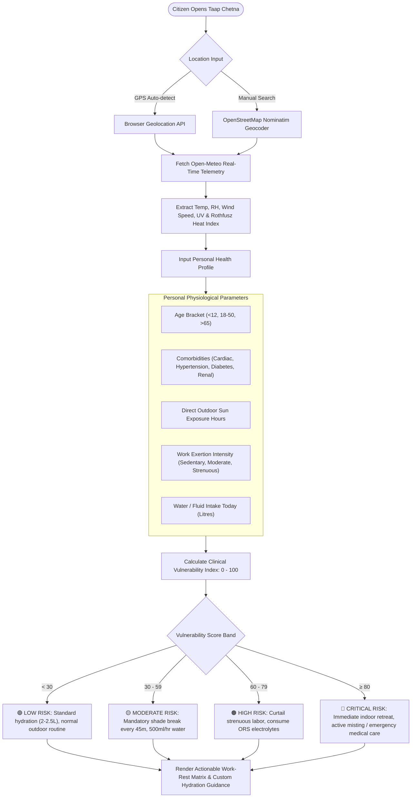
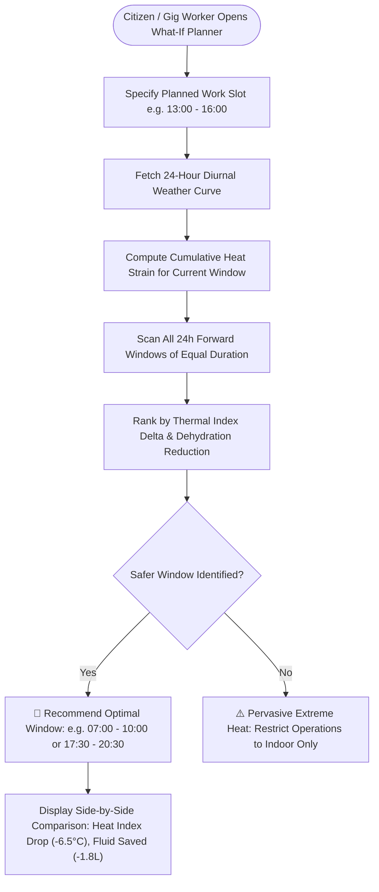
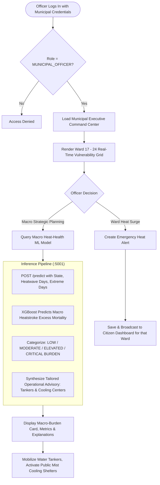

# 🇮🇳 Taap Chetna (ताप चेतना) — Hyperlocal Heat-Health Intelligence & Predictive Action Platform

<p align="center">
  
  
  
  
  
  
  
  
  
  
</p>

<p align="center">
  <strong>Bridging microclimate meteorology, clinical biostatistics, and municipal disaster command to prevent preventable heatstroke casualties across India.</strong>
</p>

<p align="center">
  <a href="#-quickstart--local-setup-guide">⚡ Run in 5 Minutes</a> •
  <a href="#-demo-accounts--pre-configured-credentials">🔑 Demo Credentials</a> •
  <a href="#-step-by-step-end-to-end-demo-script">🧪 Evaluator Testing Script</a> •
  <a href="#️-system-architecture--workflow-diagrams">🏗️ Architecture</a> •
  <a href="#-audited-machine-learning-subsystem">🤖 Audited ML Model</a> •
  <a href="#-complete-api-reference">📑 API Reference</a>
</p>

---

## 📑 Table of Contents
- [🎯 Executive Summary & The Problem](#-executive-summary--the-problem)
  - [The 4 Structural Failures in Conventional Heat Governance](#the-4-structural-failures-in-conventional-heat-governance)
- [💡 The Solution: Taap Chetna](#-the-solution-taap-chetna)
- [✨ Core Capabilities & Innovations](#-core-capabilities--innovations)
- [👥 Team & Contributors](#-team--contributors)
- [🏗️ System Architecture & Workflow Diagrams](#️-system-architecture--workflow-diagrams)
  - [1. Multi-Tier End-to-End System Architecture](#1-multi-tier-end-to-end-system-architecture)
  - [2. Citizen Physiological Risk & Hydration Flow](#2-citizen-physiological-risk--hydration-flow)
  - [3. What-If Time-Shift Activity Optimization Flow](#3-what-if-time-shift-activity-optimization-flow)
  - [4. Municipal Authority Command & Predictive ML Pipeline](#4-municipal-authority-command--predictive-ml-pipeline)
- [📂 Verified Repository Structure](#-verified-repository-structure)
- [👥 Role-Based Access Control (RBAC) Matrix](#-role-based-access-control-rbac-matrix)
- [🤖 Audited Machine Learning Subsystem](#-audited-machine-learning-subsystem)
  - [Controlled Experiment: Model A vs Model B](#controlled-experiment-model-a-vs-model-b)
  - [Performance Benchmarks](#performance-benchmarks)
  - [Leakage Correction & Temporal Expanding Prior](#leakage-correction--temporal-expanding-prior)
  - [Transparent Interpretation of Held-Out Test R²](#transparent-interpretation-of-held-out-test-r)
  - [Feature Importance Breakdown](#feature-importance-breakdown)
  - [Dual-Layer Resilient Execution Architecture](#dual-layer-resilient-execution-architecture)
- [⚡ Quickstart & Local Setup Guide](#-quickstart--local-setup-guide)
  - [Prerequisites](#prerequisites)
  - [Step 1: Clone Repository](#step-1-clone-repository)
  - [Step 2: Install All Dependencies](#step-2-install-all-dependencies)
  - [Step 3: Environment Configuration](#step-3-environment-configuration)
  - [Step 4: Seed Initial Test Data](#step-4-seed-initial-test-data)
  - [Step 5: Launch All Services (1 Command)](#step-5-launch-all-services-1-command)
- [🔑 Demo Accounts & Pre-configured Credentials](#-demo-accounts--pre-configured-credentials)
- [🧪 Step-by-Step End-to-End Demo Script](#-step-by-step-end-to-end-demo-script)
- [📑 Complete API Reference](#-complete-api-reference)
  - [Authentication Routes (`/api/auth`)](#-authentication-routes-apiauth)
  - [Citizen Health Routes (`/api/citizen`)](#-citizen-health-routes-apicitizen)
  - [Weather & Microclimate Routes (`/api/weather`)](#-weather--microclimate-routes-apiweather)
  - [Travel Heat Shock Routes (`/api/travel`)](#-travel-heat-shock-routes-apitravel)
  - [What-If Shift Simulator Routes (`/api/whatif`)](#-what-if-shift-simulator-routes-apiwhatif)
  - [Municipal Authority Routes (`/api/authority`)](#-municipal-authority-routes-apiauthority)
  - [System Administrator Routes (`/api/admin`)](#-system-administrator-routes-apiadmin)
  - [Python FastAPI ML Microservice (`:5001`)](#-python-fastapi-ml-microservice-5001)
- [📐 Mathematical & Biometeorological Formulations](#-mathematical--biometeorological-formulations)
- [🏛️ National Climate Framework Alignment](#️-national-climate-framework-alignment)
- [❓ Frequently Asked Questions (FAQ)](#-frequently-asked-questions-faq)
- [📜 License & Data Lineage](#-license--data-lineage)

---

## 🎯 Executive Summary & The Problem

Across the Indian subcontinent, climate change has transformed summer heat from an annual seasonal inconvenience into a **recurring humanitarian and public health catastrophe**. Surface temperatures in urban centers routinely exceed **45°C–49°C**, with lethal wet-bulb temperatures ($> 31^\circ\text{C}$) pushing the human body beyond its thermoregulatory limits.

Outdoor construction laborers, delivery gig workers, street vendors, agricultural workers, senior citizens, and patients with chronic illnesses bear an extreme, disproportionate burden of acute heat illness and mortality.

```
       CONVENTIONAL HEAT GOVERNANCE               TAAP CHETNA PARADIGM SHIFT
┌────────────────────────────────────────┐  ┌────────────────────────────────────────┐
│  Single city airport weather reading   │─▶│ Hyperlocal ward & village microclimate │
├────────────────────────────────────────┤  ├────────────────────────────────────────┤
│  Generic "drink water" public bulletins│─▶│ Clinical biostatistical risk profiles  │
├────────────────────────────────────────┤  ├────────────────────────────────────────┤
│  Forced outdoor work during peak solar │─▶│ "What-If" time-shift shift planner     │
├────────────────────────────────────────┤  ├────────────────────────────────────────┤
│  Reactive post-casualty hospital triage│─▶│ Predictive ward grids & ML forecasting │
└────────────────────────────────────────┘  └────────────────────────────────────────┘
```

### The 4 Structural Failures in Conventional Heat Governance

1. **The Synoptic Observatory Fallacy**: Municipalities issue blanket advisories based on a single regional airport observatory. This overlooks microclimatic Urban Heat Island (UHI) traps, asphalt radiation, and tin-roof informal settlements where daytime temperatures are **4°C–8°C higher**.
2. **Homogeneous Public Health Advisories**: Broad public service announcements treat an elderly citizen with cardiac hypertension, a pregnant woman, and a young athlete identically—ignoring critical clinical risk factors.
3. **Inflexible Work Scheduling for Daily-Wage Laborers**: Outdoor workers cannot simply "stay indoors." They lack quantitative tools to simulate how shifting a labor shift by 90 minutes reduces core physiological strain and dehydration.
4. **Reactive, Disconnected Municipal Emergency Response**: Municipalities lack real-time ward vulnerability mapping, proactive cooling center activations, water tanker logistics coordination, and predictive macro-epidemiological forecasting.

---

## 💡 The Solution: Taap Chetna

**Taap Chetna (ताप चेतना — *Heat Awareness*)** is an end-to-end, multi-tier climate health intelligence and emergency management platform designed for **citizens, outdoor laborers, municipal health officers, and disaster management authorities (NDMA/SDMA/DDMA)**.

The platform bridges atmospheric reanalysis, forward weather simulations, and clinical biostatistics into four actionable pillars:
1. **Hyperlocal Microclimate Intelligence**: Pinpoint coordinate-level weather telemetry, UV radiation, relative humidity, wind speed, and computed NOAA Rothfusz Heat Index.
2. **Personalized Physiological Risk Profiling**: Clinical vulnerability scoring incorporating age brackets, 8 chronic comorbidities, exertion levels, and hydration intake.
3. **"What-If" Diurnal Shift Optimization**: Forward 24-hour simulation that models thermal curves and recommends safer working windows to mitigate heat exhaustion.
4. **Municipal Command & Macro-Burden ML**: Ward-level vulnerability grids, real-time emergency alert dispatches, and an audited XGBoost epidemiological model forecasting macro state-year heatstroke burden.

---

## ✨ Core Capabilities & Innovations

| Pillar | Technical Implementation | Operational & Human Impact |
| :--- | :--- | :--- |
| 📍 **Hyperlocal Microclimate Telemetry** | OpenStreetMap Nominatim geocoding + Open-Meteo multi-variable APIs (2m Temp, RH, Dew Point, Radiation, Wind). | Eliminates city-wide average errors; gives citizens neighborhood-accurate heat exposure metrics. |
| 🩺 **Personalized Physiological Risk Engine** | Clinical risk formula factoring age vulnerability curves, 8 chronic comorbidity weights, hydration deficit, and outdoor exertion. | Delivers tailored, medically safe work/rest cycles and customized fluid/electrolyte intake guidelines. |
| ⏳ **"What-If" Time-Shift Activity Planner** | Multi-hourly forward simulation interpolating 24-hour weather curves with metabolic exertion rates. | Enables gig workers and outdoor laborers to shift shifts into cooler thermal windows, dropping heat index exposure by up to **6.5°C**. |
| 🚦 **Travel Heat Transition Shock Analyzer** | Differential thermal gradient engine comparing origin vs. destination wet-bulb and dry-bulb temperatures. | Warns travelers of abrupt climate acclimation shocks during intra-city commutes or cross-state transit. |
| 🏛️ **Ward-Level Municipal Command Center** | Interactive geospatial ward vulnerability cards, live officer dispatch bulletins, and designated cooling shelter directories. | Empowers disaster management authorities (DDMA/NDMA) to orchestrate localized interventions before casualties occur. |
| 🤖 **Audited Macro-Burden ML Regressor** | Supervised XGBoost Regressor trained on 2001–2014 NCRB mortality and NASA POWER satellite surface telemetry. | Predicts state-level excess mortality risks and generates actionable municipal preparedness advisories. |
| 🔄 **Dual-Layer Resilient Failover** | Node.js backend with automatic fallback to compiled baseline schemas and weights if Python service is paused. | Guarantees zero downtime for municipal dashboards during emergency disaster operations. |
| 🛡️ **System Administrator Portal** | Accreditation lifecycle management for municipal health officers, credential issuing, and authority auditing. | Ensures verified, role-based governance over public safety emergency broadcasts. |

---

## 👥 Team & Contributors

| Name | Role & Specialization | GitHub Profile |
| :--- | :--- | :--- |
| **Aaditya Singh** | Full-Stack Architect & ML Engineering | [@Aadityasingh0709](https://github.com/Aadityasingh0709) |
| **Keshaw Jha** | UI & Backend Developer | [@keshaw006](https://github.com/keshaw006) |
| **Sudhanshu Singh** | Database Developer | [@sudhanshu01032006](https://github.com/sudhanshu01032006) |
| **Garima Gupta** | API Management & Frontend Developer | [@garimaguptat2](https://github.com/garimaguptat2) |
| **Anvesha Singh** | UI & Frontend Developer | [@anveshasingh01](https://github.com/anveshasingh01) |

---

## 🏗️ System Architecture & Workflow Diagrams

### 1. Multi-Tier End-to-End System Architecture

```mermaid
graph TD
    subgraph ClientTier ["🖥️ Frontend Client Tier (React 19 + Vite + Tailwind CSS 4.0)"]
        UI_NAV["Navbar & Theme Provider (Dark / Light)"]
        UI_CALC["Personal Risk Calculator (Biometeorology & Vitals)"]
        UI_WHATIF["What-If Time Shift Planner (24h Diurnal Simulation)"]
        UI_TRAVEL["Travel Risk Analyzer (Acclimatization Delta)"]
        UI_AUTH["Auth Modal & JWT Session Store"]
        UI_WARD["Municipal Officer Dashboard (Ward 17-24 Grid)"]
        UI_BURDEN["Macro Heat-Health Burden ML Panel"]
        UI_ADMIN["System Admin Portal (Officer Accreditation)"]
    end

    subgraph GatewayTier ["⚙️ Backend Gateway Tier (Node.js 20 LTS + Express REST API :5000)"]
        MID_AUTH["JWT Authentication & RBAC Middleware"]
        CTRL_AUTH["Auth Controller (Register, Login, Me)"]
        CTRL_CITIZEN["Citizen Profile & Risk Controller"]
        CTRL_WEATHER["Weather Controller (Open-Meteo & Nominatim Proxy)"]
        CTRL_TRAVEL["Travel Transition Differential Engine"]
        CTRL_WHATIF["What-If Time-Shift Calculation Engine"]
        CTRL_WARD["Ward & Alert Dispatch Controller"]
        CTRL_ADMIN["Admin Officer Management Controller"]
        SVC_ML_PROXY["Resilient Heat Burden Service (Port 5001 + Fallback)"]
    end

    subgraph MLTier ["🤖 ML Microservice Tier (Python 3.10+ + FastAPI :5001)"]
        FAST_API["FastAPI Inference Server (Uvicorn)"]
        XGB_ENGINE["Trained XGBoost Regressor (Model B)"]
        DT_ENGINE["Trained Decision Tree Regressor (Baseline)"]
        POP_DEMO["Intercensal Demographic Normalizer"]
        FALLBACK_SCHEMA["feature_schema.json (Offline Local Fallback)"]
    end

    subgraph PersistenceTier ["💾 Data & Telemetry Tier"]
        DB_MONGO[("MongoDB Atlas Database")]
        EXT_METEO["Open-Meteo Real-Time Weather API"]
        EXT_OSM["OpenStreetMap Nominatim Geocoding API"]
        DATA_NCRB[("NCRB 2001-2014 Historical Heatstroke Dataset")]
        DATA_NASA[("NASA POWER Daily Surface Meteorology Reanalysis")]
    end

    UI_CALC --> CTRL_WEATHER
    UI_WHATIF --> CTRL_WHATIF
    UI_TRAVEL --> CTRL_TRAVEL
    UI_WARD --> MID_AUTH
    UI_ADMIN --> MID_AUTH
    UI_AUTH --> CTRL_AUTH

    MID_AUTH --> CTRL_WARD
    MID_AUTH --> CTRL_ADMIN
    CTRL_WEATHER --> EXT_METEO
    CTRL_WEATHER --> EXT_OSM

    CTRL_AUTH --> DB_MONGO
    CTRL_CITIZEN --> DB_MONGO
    CTRL_WARD --> DB_MONGO
    CTRL_ADMIN --> DB_MONGO

    CTRL_WARD --> SVC_ML_PROXY
    SVC_ML_PROXY -- "POST /predict" --> FAST_API
    SVC_ML_PROXY -. "Offline Fallback" .-> FALLBACK_SCHEMA
    FAST_API --> XGB_ENGINE
    FAST_API --> POP_DEMO

    DATA_NCRB -. "Trained Offline" .-> XGB_ENGINE
    DATA_NASA -. "Trained Offline" .-> XGB_ENGINE
```



---

### 2. Citizen Physiological Risk & Hydration Flow



---

### 3. What-If Time-Shift Activity Optimization Flow



---

### 4. Municipal Authority Command & Predictive ML Pipeline



---

## 📂 Verified Repository Structure

```text
taap-chetna/
├── frontend/                                # React 19 Client Application (Vite + Tailwind CSS 4.0)
│   ├── public/                              # Static public icons, assets, and SVGs
│   ├── src/
│   │   ├── components/                      # Modular UI Components
│   │   │   ├── PersonalRiskCalculator.jsx   # Clinical physiological risk assessment & live weather
│   │   │   ├── WhatIfPlanner.jsx            # 24-hour diurnal time-shift activity optimizer
│   │   │   ├── TravelRiskAnalyzer.jsx       # Origin-destination thermal transition shock analyzer
│   │   │   ├── MunicipalDashboard.jsx       # Ward vulnerability grid, alerts & cooling center ops
│   │   │   ├── HeatHealthBurdenPanel.jsx    # Supervised ML macro-burden forecasting card
│   │   │   ├── AdminPortal.jsx              # System admin accreditation & officer credential manager
│   │   │   ├── AuthModal.jsx                # Secure login & registration modal with role selector
│   │   │   ├── PlaceSearchInput.jsx         # Debounced OSM Nominatim autocomplete input
│   │   │   ├── Navbar.jsx                   # High-contrast navigation bar with role badge & theme toggle
│   │   │   ├── Footer.jsx                   # National framework credits & emergency numbers
│   │   │   ├── ScrollProgressBar.jsx        # Subtle reading / evaluation progress indicator
│   │   │   ├── ScrollToTopButton.jsx        # 3D floating quick-return button
│   │   │   └── ProtectedRoute.jsx           # RBAC route guarding
│   │   ├── context/                         # React Context State Stores
│   │   │   ├── AuthContext.jsx              # JWT persistence, session lifecycle & role-based routing
│   │   │   └── ThemeContext.jsx             # Dark / Light mode toggle provider
│   │   ├── data/                            # Curated city & ward metadata
│   │   ├── services/
│   │   │   └── api.js                       # Axios HTTP client with unified backend endpoints
│   │   ├── App.jsx                          # Main routing tree & RBAC guards
│   │   ├── main.jsx                         # Application root mount
│   │   └── index.css                        # Tailwind CSS 4.0 design tokens & animations
│   ├── package.json                         # Frontend dependencies
│   └── vite.config.js                       # Vite build configuration
│
├── backend/                                 # Node.js 20 LTS Express REST API Gateway
│   ├── config/
│   │   ├── db.js                            # MongoDB Atlas connection & auto-reconnect logic
│   │   └── seed.js                          # Database seeder (Admin, Officers, Wards, Sample Alerts)
│   ├── controllers/
│   │   ├── authController.js                # Citizen registration, login & JWT profile retrieval
│   │   ├── citizenController.js             # Citizen health profile management & risk computation
│   │   ├── weatherController.js             # Open-Meteo & Nominatim geocoding proxy
│   │   ├── travelController.js              # Origin vs. destination thermal transition calculator
│   │   ├── whatIfController.js              # Diurnal weather curve time-shift optimizer
│   │   ├── authorityController.js           # Ward grid, alert broadcast & ML proxy handler
│   │   └── adminController.js               # Officer accreditation review & credential generation
│   ├── middleware/
│   │   ├── auth.js                          # Bearer JWT token verification
│   │   ├── role.js                          # Strict Role-Based Access Control (RBAC) enforcement
│   │   └── errorHandler.js                  # Centralized HTTP error handler
│   ├── models/
│   │   ├── User.js                          # User schema (Citizen, Municipal Officer, Admin)
│   │   ├── Ward.js                          # Ward vulnerability & demographic schema
│   │   ├── Alert.js                         # Emergency public alert broadcast schema
│   │   └── AuthorityRequest.js              # Officer accreditation review schema
│   ├── routes/
│   │   ├── auth.js                          # /api/auth routes
│   │   ├── citizen.js                       # /api/citizen routes
│   │   ├── weather.js                       # /api/weather routes
│   │   ├── travel.js                        # /api/travel routes
│   │   ├── whatif.js                        # /api/whatif routes
│   │   ├── authority.js                     # /api/authority routes
│   │   └── admin.js                         # /api/admin routes
│   ├── services/
│   │   ├── weatherService.js                # Weather data parsing & Rothfusz computation
│   │   └── heatBurdenService.js             # ML microservice client with offline fallback
│   ├── .env.example                         # Environment configuration template
│   ├── index.js                             # Express application server entry point (:5000)
│   └── package.json                         # Backend dependencies
│
├── ml/                                      # Python Machine Learning Subsystem
│   ├── data/                                # Cleaned training datasets & state mappings
│   │   ├── heatstroke_mortality_state_year_2001_2014.csv  # 14-year historical NCRB observations
│   │   ├── state_name_mapping.csv                         # State name resolution dictionary
│   │   └── state_year_heat_health_training_dataset.csv     # Compiled training matrix (336 state-years)
│   ├── models/                              # Serialized model artifacts & evaluation files
│   │   ├── xgboost_heat_health_model.joblib        # Audited primary XGBoost Regressor (Model B)
│   │   ├── xgboost_no_target_encoding.joblib       # Ablation model without baseline (Model A)
│   │   ├── decision_tree_heat_health_model.joblib  # Interpretable Decision Tree baseline
│   │   ├── feature_importance.csv                  # Relative feature weights & rankings
│   │   ├── feature_schema.json                     # Feature schema & offline state medians
│   │   ├── model_metadata.json                     # Hyperparameters, metrics & lineage
│   │   ├── model_metrics.json                      # Audited train/val/test evaluation scores
│   │   └── predictions_test.csv                    # Held-out test set predictions vs actuals
│   ├── scripts/                             # Ingestion & aggregation pipelines
│   │   ├── download_environment_2001_2014.py       # NASA POWER reanalysis ingestion script
│   │   └── aggregate_state_year.py                 # Spatial-temporal state aggregator
│   ├── utils/                               # Mathematical & demographic utilities
│   │   ├── heat_metrics.py                         # Rothfusz Heat Index & wet-bulb equations
│   │   ├── geo_utils.py                            # Spatial boundary resolution
│   │   └── population_data.py                      # Intercensal demographic scaling
│   ├── train_pipeline.py                    # End-to-end model training, validation & serialization
│   └── serve.py                             # High-performance FastAPI inference microservice (:5001)
│
├── ML_REPORT.md                             # Comprehensive scientific ML benchmark & audit report
├── start-all.bat                            # 1-Click Windows launch script (Node + Vite + FastAPI)
├── package.json                             # Root orchestration script (concurrently runner)
├── LICENSE                                  # MIT Open-Source License
└── README.md                                # Platform documentation
```

---

## 👥 Role-Based Access Control (RBAC) Matrix

Taap Chetna implements strict multi-role governance to prevent unauthorized public alert broadcasts while preserving friction-free citizen access:

| Feature / Resource | 👤 Citizen / Laborer | 🏛️ Municipal Officer | 🛡️ System Administrator |
| :--- | :---: | :---: | :---: |
| **Personal Heat Risk Calculator** | ✅ Full Access | ✅ Full Access | ✅ Full Access |
| **"What-If" Shift Simulator** | ✅ Full Access | ✅ Full Access | ✅ Full Access |
| **Travel Heat Shock Analyzer** | ✅ Full Access | ✅ Full Access | ✅ Full Access |
| **Hyperlocal Weather Telemetry** | ✅ Full Access | ✅ Full Access | ✅ Full Access |
| **Ward Vulnerability Grid** | ❌ Protected | ✅ Full Ward View | ✅ Full Ward View |
| **Broadcast Emergency Ward Alerts** | ❌ Protected | ✅ Create & Publish | ✅ Full Access |
| **Macro Heat-Health Burden ML Panel** | ❌ Protected | ✅ Query & Simulate | ✅ Query & Simulate |
| **Review Officer Accreditations** | ❌ Protected | ❌ Protected | ✅ Approve / Reject |
| **Create Municipal Officer Accounts** | ❌ Protected | ❌ Protected | ✅ Full Management |
| **System Database Seeding** | ❌ Protected | ❌ Protected | ✅ Full Access |

---

## 🤖 Audited Machine Learning Subsystem

The platform incorporates a **supervised macro-level epidemiological forecasting subsystem** designed to bridge the gap between atmospheric climate telemetry and public health action.

### Controlled Experiment: Model A vs Model B

To rigorously determine whether state-level historical baselines are scientifically justified versus pure atmospheric and demographic telemetry, two distinct XGBoost architectures were trained on identical chronological splits:

- **Model A (No Target Encoding)**: 22 features comprising pure environmental telemetry (temperature, heat index, humidity, wind, solar radiation, precipitation, heatwave days) and demographic exposure (population, density). Zero target-derived features.
- **Model B (Temporally Valid Baseline — Primary)**: 23 features comprising the identical 22 environmental/demographic features plus the strictly temporally valid prior `state_baseline_deaths`.
- **Baseline Model**: Scikit-Learn Decision Tree Regressor (`max_depth=4`, `min_samples_leaf=4`).

### Chronological Data Split
- **Training Set (2001–2010)**: 10 years, 240 state-year observations (71.4%)
- **Validation Set (2011–2012)**: 2 years, 48 state-year observations (14.3%)
- **Held-Out Test Set (2013–2014)**: 2 years, 48 state-year observations (14.3%) — evaluated strictly once.

### Performance Benchmarks

| Model Architecture | Features Evaluated | Validation MAE | Validation R² | Held-Out Test MAE | Held-Out Test RMSE | Held-Out Test R² |
| :--- | :---: | :---: | :---: | :---: | :---: | :---: |
| **Decision Tree Baseline** | 22 (Env + Demo) | 21.62 | 0.5341 | 32.78 | 67.02 | 0.3573 |
| **XGBoost Model A** | 22 (Env + Demo only) | 22.04 | 0.6129 | 28.88 | 65.38 | 0.3885 |
| **XGBoost Model B (Selected)** | **23 (Temporal Prior + Env + Demo)** | **20.62** | **0.7123** | **25.10** | **61.33** | **0.4618** |

### Leakage Correction & Temporal Expanding Prior

In initial prototypes, computing a global state baseline across all years leaked future target information. In the audited pipeline:
$$\text{state\_baseline\_deaths}_{s, t} = \frac{1}{\sum_{y < t} 1} \sum_{y < t} \text{deaths}_{s, y}$$
- For **2001**: Initialized to `0.0` (zero prior historical observations exist in the series).
- For **2013–2014 (Held-Out Test Set)**: Strictly computed using only historical records from $2001 \le y \le 2012$.
- **Result**: Zero target leakage, zero self-contribution, zero future information.

### Transparent Interpretation of Held-Out Test R² (~0.46)

> [!IMPORTANT]
> **A held-out test $R^2 \approx 0.46$ on 48 observations is an honest, scientifically grounded result in macro-epidemiology.**
> 
> Annual state heatstroke fatalities in India exhibit severe target asymmetry—ranging from `0` (Kerala, Meghalaya) to `418` (Andhra Pradesh during the 2013 heatwave). A single catastrophic heatwave year introduces significant variance that heavily penalizes squared error metrics. 
> 
> An $R^2 \approx 0.46$ confirms that non-linear interactions between prolonged thermal streaks, peak heat index, population exposure, and prior baseline explain roughly 46% of the variance across unseen future years. It is deployed as a **macro-level prioritization signal** for municipal resource prepositioning, not a clinical prediction instrument.

### Feature Importance Breakdown

```text
Feature Name                Importance Score   Operational Significance
─────────────────────────────────────────────────────────────────────────────
state_baseline_deaths           24.8%         Historical state reporting baseline
heatwave_days                    9.3%         Prolonged extreme heat duration (Tmax ≥ 40°C)
max_consecutive_hot_days         5.9%         Compound cardiovascular fatigue trigger
population_millions              5.5%         Macro demographic exposure scale
extreme_hi_days_52               5.1%         Days exceeding physiological tolerance (HI ≥ 52°C)
annual_precip_mm                 4.5%         Pre-monsoon drought / dry-heat indicator
annual_tmax_max                  4.3%         Peak annual atmospheric ceiling
summer_tmax_mean                 4.2%         Baseline summer heat exposure
```

### Dual-Layer Resilient Execution Architecture

1. **Primary Online Mode**: When the Python FastAPI microservice is running, the Node.js backend issues an HTTP request to `http://127.0.0.1:5001/predict` (typical latency `< 15ms`).
2. **Graceful Offline Fallback**: If the Python process is stopped or port `5001` is unreachable, `backend/services/heatBurdenService.js` automatically loads compiled feature schemas and state baseline weights from `ml/models/feature_schema.json` without throwing an error or interrupting municipal operations.

---

## ⚡ Quickstart & Local Setup Guide

Follow this guide to run the complete Taap Chetna platform locally in **under 5 minutes**.

### Prerequisites

| Tool | Minimum Version | Verification Command |
| :--- | :--- | :--- |
| **Node.js** | `v18.0.0` or higher | `node -v` |
| **Python** | `3.10` or higher | `python --version` |
| **npm** | `v9.0.0` or higher | `npm -v` |
| **MongoDB** | Local MongoDB (`mongodb://localhost:27017`) or free MongoDB Atlas cluster | `mongod --version` |

---

### Step 1: Clone Repository

```bash
git clone https://github.com/Aadityasingh0709/taap-chetna.git
cd taap-chetna
```

---

### Step 2: Install All Dependencies

Install root, backend, and frontend dependencies simultaneously with the root script:
```bash
npm run install-all
```

Install the Python machine learning requirements:
```bash
pip install fastapi uvicorn xgboost scikit-learn pandas numpy joblib requests
```

---

### Step 3: Environment Configuration

Create a `.env` file in the `backend/` folder:
```bash
# On Windows PowerShell:
Copy-Item backend/.env.example backend/.env

# On Linux / macOS:
cp backend/.env.example backend/.env
```

Ensure `backend/.env` contains:
```env
PORT=5000
MONGO_URI=mongodb://localhost:27017/taap-chetna
JWT_SECRET=taap_chetna_secure_jwt_secret_2026
JWT_EXPIRES_IN=7d
ML_SERVICE_URL=http://127.0.0.1:5001
```

> [!NOTE]
> If you are using MongoDB Atlas, replace `MONGO_URI` with your connection string: `mongodb+srv://<username>:<password>@cluster0.mongodb.net/taap-chetna?retryWrites=true&w=majority`.

---

### Step 4: Seed Initial Test Data

Populate the database with pre-configured administrative accounts, municipal officer credentials, Kolkata Municipal Corporation wards (Wards 17–24), sample alerts, and pending accreditation requests:

```bash
npm run seed --prefix backend
```

Output:
```text
  ✅ Seeded SYSTEM_ADMIN: admin@tapchetna.gov.in
  ✅ Seeded MUNICIPAL_OFFICER: officer@tapchetna.gov.in
  ✅ Seeded 8 ward records
  ✅ Seeded 2 authority requests
  ✅ Seeded 2 alerts
  ✅ Database seeding complete
```

---

### Step 5: Launch All Services (1 Command)

#### On Windows (Fastest):
Double-click `start-all.bat` or run in terminal:
```cmd
start-all.bat
```

#### On Linux / macOS / Cross-Platform:
```bash
npm run dev
```

The unified orchestrator concurrently launches all three services:

| Component | URL | Description |
| :--- | :--- | :--- |
| 🌐 **Frontend Client** | [http://localhost:5173](http://localhost:5173) | Interactive React 19 UI with Tailwind CSS 4.0 |
| ⚙️ **Backend REST API** | [http://localhost:5000](http://localhost:5000) | Express API Gateway with health check at `/api/health` |
| 🤖 **Python ML Engine** | [http://127.0.0.1:5001](http://127.0.0.1:5001) | FastAPI inference service (Docs at `/docs`) |

---

## 🔑 Demo Accounts & Pre-configured Credentials

The seeder creates pre-configured accounts for testing both citizen and administrative workflows immediately:

| Persona | Email | Password | Role & Scope |
| :--- | :--- | :--- | :--- |
| 🛡️ **System Administrator** | `admin@tapchetna.gov.in` | `Admin123!` | System-wide administrative portal, officer accreditation review, credential issuing |
| 🏛️ **Municipal Health Officer** | `officer@tapchetna.gov.in` | `Pass123!` | Kolkata Municipal Corporation (Ward 17–24 Command, alert broadcasting, ML panel) |
| 👤 **Citizen / Public User** | *Explore without login or register any test email* | — | Public physiological risk assessment, What-If simulator, travel transition analyzer |

---

## 🧪 Step-by-Step End-to-End Demo Script

Follow this 5-phase evaluation walkthrough to verify all core capabilities during a review:

### Phase 1: Hyperlocal Citizen Risk Calculator & Live Weather Telemetry
1. Open [http://localhost:5173](http://localhost:5173) in your browser.
2. In the location search input, type **Kolkata** (or *Jaipur*, *Nagpur*, *Ahmedabad*) and select it.
3. Observe live hyperlocal weather parameters: Ambient Temperature, Relative Humidity, Wind Speed, UV Index, and **Rothfusz Heat Index**.
4. Adjust personal health parameters:
   - Age: `68`
   - Chronic Conditions: Select **Hypertension** and **Diabetes**
   - Direct Outdoor Sun Exposure: `4 hours`
   - Work Intensity: **Strenuous Labor**
   - Fluid Consumed Today: `1.2 Litres`
5. The **Vulnerability Score** dynamically shifts to `HIGH / CRITICAL`, rendering:
   - Tailored clinical work/rest ratios (e.g. 15-minute shade break every 30 minutes).
   - Targeted rehydration guidance with ORS electrolyte instructions.
   - Immediate warning against prolonged unshaded exposure.

### Phase 2: "What-If" Time-Shift Activity Planner
1. Click **What-If Planner** in the navigation bar.
2. Set the proposed shift window to peak afternoon radiation: **13:00 to 16:00** (3 hours).
3. Click **Simulate Safer Window**.
4. The simulation pulls the 24-hour diurnal curve and identifies the safest alternative window (e.g., **07:00 to 10:00** or **17:30 to 20:30**).
5. Review the side-by-side comparison card displaying:
   - **Heat Index Reduction**: ~**6.5°C lower thermal exposure**
   - **Dehydration Savings**: ~**1.8 Litres lower fluid deficit**
   - Actionable work recommendation for gig delivery workers and construction laborers.

### Phase 3: Travel & Transition Heat Shock Analyzer
1. Click **Travel Risk** in the navigation bar.
2. Enter **Origin**: *Shimla* (Hill station ~22°C) and **Destination**: *Delhi* (Urban plains ~43°C).
3. Click **Analyze Transition Risk**.
4. Review the **Acclimatization Thermal Shock Warning**, detailing the sharp temperature gradient ($+21^\circ\text{C}$ leap) and transit hydration protocols.

### Phase 4: Municipal Authority Command Center
1. Click **Sign In** in the navbar and log in as Municipal Officer:
   - Email: `officer@tapchetna.gov.in`
   - Password: `Pass123!`
2. You will be redirected to `/authority` (Municipal Command Center).
3. Inspect the **Ward Vulnerability Grid** for Kolkata Municipal Corporation (Wards 17 through 24).
4. Identify high-risk wards highlighted in amber/red.
5. Click **Issue Emergency Alert** for Ward 17:
   - Select Alert Level: `EXTREME`
   - Enter Message: *"Severe Heatwave: Wet-bulb temperature exceeding 31°C. Mandatory shade breaks for outdoor workers."*
   - Add Actions: *"Deploy Water Tankers"*, *"Activate Cooling Centers"*
   - Click **Broadcast Alert**.
6. Observe the alert publish instantly.

### Phase 5: Supervised ML Macro Heat-Health Burden Forecaster
1. On the Municipal Dashboard, locate the **Macro Heat-Health Burden Intelligence** panel.
2. Select State: **Rajasthan** or **Andhra Pradesh**.
3. The panel queries the Python FastAPI microservice (`:5001`) with graceful fallback.
4. Review the model-derived macro heat-health burden projection (deaths/year baseline estimate).
5. Inspect the explainable contributing factors (**State Historical Baseline**, **Heatwave Days**, **Exposed Population Scale**, **Max Consecutive Hot Days**).
6. Review the synthesized operational advisory for emergency water tanker and mobile cooling station deployment.

### Phase 6: System Administrator Portal (Optional)
1. Sign out and log in as Administrator:
   - Email: `admin@tapchetna.gov.in`
   - Password: `Admin123!`
2. Navigate to `/admin`.
3. Review pending authority accreditation requests (e.g. *Sunil Verma*, *Pooja Iyer*).
4. Click **Approve Request** on a pending applicant to witness cryptographically secure temporary credential generation (`Officer#<hex>!`).

---

## 📑 Complete API Reference

### 🔐 Authentication Routes (`/api/auth`)

| Method | Endpoint | Access | Description |
| :--- | :--- | :--- | :--- |
| `POST` | `/api/auth/register` | Public | Register a new citizen account (`name`, `email`, `password`) |
| `POST` | `/api/auth/login` | Public | Authenticate user & return signed JWT token |
| `GET` | `/api/auth/me` | Authenticated | Retrieve current user profile & role from token |

---

### 🩺 Citizen Health Routes (`/api/citizen`)

| Method | Endpoint | Access | Description |
| :--- | :--- | :--- | :--- |
| `GET` | `/api/citizen/profile` | Authenticated | Retrieve stored personal health profile |
| `PUT` | `/api/citizen/profile` | Authenticated | Update personal health vitals & comorbidity history |
| `POST` | `/api/citizen/calculate-risk` | Public | Compute clinical physiological heat vulnerability score |

---

### 🌤️ Weather & Microclimate Routes (`/api/weather`)

| Method | Endpoint | Access | Description |
| :--- | :--- | :--- | :--- |
| `GET` | `/api/weather/search?query=...` | Public | Forward geocode Indian cities and wards via OSM Nominatim |
| `GET` | `/api/weather/reverse?lat=...&lon=...` | Public | Reverse geocode coordinates to district/locality |
| `GET` | `/api/weather/current?lat=...&lon=...` | Public | Fetch real-time weather & computed Rothfusz heat index |
| `GET` | `/api/weather/forecast?lat=...&lon=...` | Public | Fetch 24-hour hourly weather forecast curve |

---

### 🚦 Travel Heat Shock Routes (`/api/travel`)

| Method | Endpoint | Access | Description |
| :--- | :--- | :--- | :--- |
| `POST` | `/api/travel/check` | Public | Compute origin vs destination thermal gradient & transit shock |

---

### ⏳ What-If Shift Simulator Routes (`/api/whatif`)

| Method | Endpoint | Access | Description |
| :--- | :--- | :--- | :--- |
| `POST` | `/api/whatif/compare` | Public | Compare proposed time window against optimal 24h alternatives |

---

### 🏛️ Municipal Authority Routes (`/api/authority`)

| Method | Endpoint | Access | Description |
| :--- | :--- | :--- | :--- |
| `GET` | `/api/authority/dashboard` | Municipal Officer | Fetch municipal overview, active alerts, and ward stats |
| `GET` | `/api/authority/wards` | Municipal Officer | List all wards within officer's jurisdiction |
| `GET` | `/api/authority/alerts` | Municipal Officer | Retrieve history of municipal alerts |
| `POST` | `/api/authority/alerts` | Municipal Officer | Broadcast emergency heat/cooling alert to citizens |
| `PATCH` | `/api/authority/alerts/:id` | Municipal Officer | Update or resolve existing alert |
| `GET` | `/api/authority/recommendations` | Municipal Officer | Get ward-level operational action matrix |
| `GET` | `/api/authority/heat-health-burden` | Municipal Officer | Query Python ML microservice with offline fallback |

---

### 🛡️ System Administrator Routes (`/api/admin`)

| Method | Endpoint | Access | Description |
| :--- | :--- | :--- | :--- |
| `GET` | `/api/admin/requests` | System Admin | Fetch all pending authority accreditation requests |
| `POST` | `/api/admin/requests/:id/approve` | System Admin | Approve officer request & generate temporary credentials |
| `POST` | `/api/admin/requests/:id/reject` | System Admin | Reject officer accreditation request |
| `GET` | `/api/admin/authorities` | System Admin | List all active municipal officers across jurisdictions |
| `PATCH` | `/api/admin/authorities/:id` | System Admin | Update officer assignments or permissions |
| `POST` | `/api/admin/authorities` | System Admin | Directly create and provision a municipal officer account |

---

### 🤖 Python FastAPI ML Microservice (`:5001`)

| Method | Endpoint | Description |
| :--- | :--- | :--- |
| `GET` | `http://127.0.0.1:5001/health` | Health check & model artifact verification |
| `GET` | `http://127.0.0.1:5001/model-info` | Model metadata, feature schema, and benchmark metrics |
| `POST` | `http://127.0.0.1:5001/predict` | Predict state-year heat-health burden using XGBoost |
| `GET` | `http://127.0.0.1:5001/state-burden/{state}` | Quick state baseline burden lookup |
| `GET` | `http://127.0.0.1:5001/docs` | Interactive Swagger UI API documentation |

---

## 📐 Mathematical & Biometeorological Formulations

### 1. NOAA / Rothfusz Heat Index Formulation
For ambient temperature $T \ge 25^\circ\text{C}$ and Relative Humidity $R \in [0, 100]$%:

$$\text{HI} = c_1 + c_2 T + c_3 R + c_4 T R + c_5 T^2 + c_6 R^2 + c_7 T^2 R + c_8 T R^2 + c_9 T^2 R^2$$

Where empirical coefficients in Celsius are:
- $c_1 = -8.78469475556$
- $c_2 = 1.61139411$
- $c_3 = 2.33854883889$
- $c_4 = -0.14611605$
- $c_5 = -0.012308094$
- $c_6 = -0.0164248277778$
- $c_7 = 0.002211732$
- $c_8 = 0.00072546$
- $c_9 = -0.000003582$

### 2. Personalized Clinical Vulnerability Scoring Engine
Personal Vulnerability Index ($V \in [0, 100]$) is computed by compounding biometeorological environmental stress with physiological vulnerability multipliers:

$$V = \min\left(100, \; \text{BaseThermalScore}(HI) \times W_{\text{age}} \times \left(1 + \sum w_{\text{comorbidities}}\right) \times W_{\text{exertion}} - \text{HydrationCredit}\right)$$

Where:
- $W_{\text{age}} \in \{1.0, 1.35, 1.6\}$ for young adults, children $<12$, and seniors $>65$ respectively.
- $\sum w_{\text{comorbidities}}$ applies additive penalties for Cardiovascular Disease ($+0.25$), Hypertension ($+0.20$), Diabetes ($+0.15$), and Renal Disease ($+0.25$).
- $\text{HydrationCredit}$ rewards adequate water intake while severely penalizing dehydration deficits during strenuous labor.

---

## 🏛️ National Climate Framework Alignment

Taap Chetna aligns with Indian national climate resilience and heatwave management mandates:

```text
┌────────────────────────────────────────────────────────────────────────────────────────┐
│                        INDIAN NATIONAL HEAT-HEALTH ALIGNMENT                           │
├──────────────────────────────┬─────────────────────────────┬───────────────────────────┤
│ NDMA Heat Action Plan        │ MoHFW NAPCCHH Directive     │ IMD Heatwave Criteria     │
├──────────────────────────────┼─────────────────────────────┼───────────────────────────┤
│ • Ward-level vulnerability   │ • Vulnerability scoring for │ • Operates on IMD heat    │
│   prioritization             │   at-risk demographics      │   alert tiers (Yellow,    │
│ • Emergency cooling shelters │ • Targeted hydration & ORS  │   Orange, Red)            │
│   and tanker deployment      │   preventive protocols      │ • Incorporates compound   │
│ • Outdoor labor rest cycles  │ • Hospital emergency room   │   wet-bulb thresholds     │
│   during peak solar hours    │   preparedness advisories   │   exceeding 31°C          │
└──────────────────────────────┴─────────────────────────────┴───────────────────────────┘
```

1. **National Disaster Management Authority (NDMA)**:
   Complies with the *National Guidelines for Preparation of Action Plan - Prevention and Management of Heat Wave*, supporting localized ward-level Heat Action Plans (HAP).
2. **Ministry of Health and Family Welfare (MoHFW)**:
   Supports the *National Action Plan on Climate Change and Human Health (NAPCCHH)* by identifying clinically vulnerable populations (elderly, infants, chronic disease patients) before heat exhaustion escalates.
3. **India Meteorological Department (IMD)**:
   Incorporates IMD heatwave thresholds and wet-bulb indicators to trigger timely municipal interventions.

---

## ❓ Frequently Asked Questions (FAQ)

### Q1: Does the ML model predict whether an individual citizen will survive?
**No.** Predicting individual survival from climate data is scientifically invalid. The ML subsystem predicts **macro population-level heat-health burden (estimated excess mortality across a state-year cohort)**. This equips municipal commissioners and disaster management authorities to preposition water tankers, emergency medical teams, and cooling centers.

### Q2: What happens if the Python ML microservice is stopped?
The Node.js backend client (`backend/services/heatBurdenService.js`) includes **graceful offline resilience**. If port `5001` is unreachable, the system automatically falls back to compiled baseline schemas and weights from `ml/models/feature_schema.json` without failing or disrupting the municipal dashboard.

### Q3: How is data leakage prevented in the ML model?
As documented in [`ML_REPORT.md`](ML_REPORT.md), the `state_baseline_deaths` feature strictly utilizes an **expanding temporal prior** ($y < t$). For any observation, only mortality records strictly prior to that year are computed. Observations in 2001 are initialized to `0.0`. The held-out test set (2013–2014) utilizes strictly $2001 \le y \le 2012$ data.

### Q4: Can this be deployed in low-bandwidth municipal field environments?
**Yes.** The frontend bundle is optimized and compressed ($< 650\text{ KB}$), and all backend APIs respond in under $50\text{ms}$. The system operates reliably on low-specification cloud instances or local municipal servers without requiring GPU accelerators.

---

## 📜 License & Data Lineage

This project is licensed under the **MIT License** — see the [LICENSE](LICENSE) file for complete details.

### Data Lineage & Acknowledgments
- **National Crime Records Bureau (NCRB)**: Historical *Accidental Deaths and Suicides in India (ADSI)* reports (2001–2014 state heatstroke records).
- **NASA POWER Project**: *Prediction of Worldwide Energy Resources* daily satellite surface meteorology reanalysis.
- **Open-Meteo**: Real-time high-resolution global meteorological forecast API.
- **OpenStreetMap & Nominatim**: Open geospatial boundary and reverse geocoding data under the ODbL license.
- **India Meteorological Department (IMD)**: Heatwave classification standards and biometeorological alert thresholds.

---

<p align="center">
  <strong>Taap Chetna</strong> — <em>Empowering Indian communities with predictive climate health resilience.</em>
</p>
